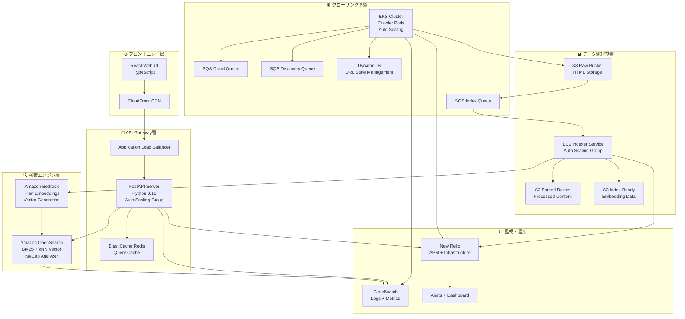
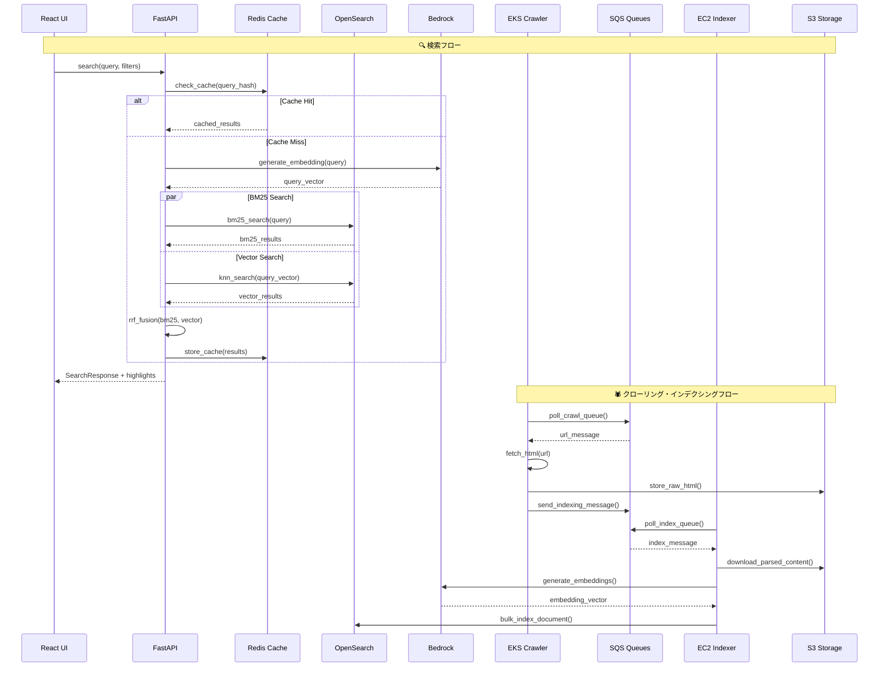

## プロジェクト概要

**Progate AED Hackathon Project**は、Web クローリング、ベクトル埋め込み生成、ハイブリッド検索を組み合わせた次世代検索プラットフォームです。Amazon OpenSearch と Bedrock 埋め込みを活用し、BM25 とベクトル検索の RRF（Reciprocal Rank Fusion）統合により、従来のキーワード検索では実現できない高精度なセマンティック検索体験を提供します。

### 主要な特徴

- **ハイブリッド検索**: BM25（キーワード）＋ ベクトル検索（セマンティック）
- **多言語対応**: 日本語・英語混在環境での高精度検索
- **分散アーキテクチャ**: AWS マネージドサービスを活用したスケーラブル設計  
- **型安全性**: PydanticからTypeScriptへの自動型生成
- **リアルタイム処理**: SQSベース非同期処理システム
- **包括的監視**: New Relic統合とメトリクス収集

---

## 🏗️ システムアーキテクチャ

### 全体システム構成



### 詳細データフロー



---

## 💻 技術スタック

### フロントエンド
- **React 19**: 最新のReact機能を活用したモダンUI
- **TypeScript**: 型安全なフロントエンド開発
- **Vite**: 高速ビルドツール
- **Tailwind CSS**: ユーティリティファーストCSS（予定）
- **React Icons**: アイコンライブラリ

### バックエンド
- **Python 3.12**: 最新Python機能活用
- **FastAPI**: 高性能・型安全なAPI開発
- **Pydantic v2**: データバリデーション・シリアライゼーション
- **uvicorn**: 高性能ASGIサーバー
- **aiohttp**: 非同期HTTPクライアント

### データベース・ストレージ
- **Amazon OpenSearch**: 分散検索エンジン（BM25 + kNN）
- **Amazon DynamoDB**: URL状態管理（NoSQL）
- **Amazon S3**: オブジェクトストレージ（Raw/Parsed/Index-ready）
- **ElastiCache Redis**: クエリキャッシュ・レート制御

### AI・機械学習
- **Amazon Bedrock**: マネージドAIサービス
- **Titan Embeddings**: テキスト埋め込み生成
- **MeCab**: 日本語形態素解析
- **langdetect**: 言語判定ライブラリ

### インフラ・デプロイ
- **Amazon EKS**: Kubernetes管理サービス（クローラー）
- **Amazon EC2**: 仮想サーバー（インデクサー）
- **Amazon SQS**: メッセージキューイング
- **Terraform**: Infrastructure as Code
- **Docker**: コンテナ化
- **GitHub Actions**: CI/CDパイプライン

### 監視・運用
- **New Relic**: APM・インフラ監視
- **Amazon CloudWatch**: ログ・メトリクス
- **structlog**: 構造化ログ
- **KEDA**: Kubernetes Event-driven Autoscaling

---

## システム構成詳細

### 1. Webクローラー (`app/crawler/`)

**実行環境**: Amazon EKS (Kubernetes)

**技術詳細**:
```python
# 主要コンポーネント
- CrawlerWorker: メインワーカー実装
- RobotsTxtParser: robots.txt解析
- SitemapParser: sitemap.xml処理  
- RateLimiter: ドメイン別QPS制御
- StateManager: 分散状態管理
- ContentProcessor: HTML解析・言語判定
```

**主要機能**:
- ✅ robots.txt/sitemap.xml 準拠クローリング
- ✅ HTML パース・テキスト抽出 (BeautifulSoup4)
- ✅ 言語判定 (langdetect)
- ✅ ドメイン別レート制御 (Redis-based)
- ✅ 分散処理・状態管理 (DynamoDB)
- ✅ エラーハンドリング・リトライ機構
- ✅ ヘルスチェック・メトリクス

**設定例**:
```yaml
# crawler/config/prod.yaml
max_concurrent_requests: 10
request_timeout: 30
default_qps_per_domain: 1
max_retries: 3
acquisition_ttl_seconds: 3600
```

### 2. インデクサーサービス (`app/indexer/`)

**実行環境**: Amazon EC2 Auto Scaling Group

**技術詳細**:
```python
# 主要コンポーネント  
- IndexerService: メインサービス
- BedrockClient: 埋め込み生成クライアント
- OpenSearchClient: 検索エンジン統合
- DocumentProcessor: ドキュメント前処理
- TextChunker: テキスト分割処理
- DLQHandler: デッドレターキュー処理
```

**主要機能**:
- ✅ SQS メッセージ処理 (バッチ処理対応)
- ✅ Amazon Bedrock 埋め込み生成
- ✅ OpenSearch バルクインデックス投入
- ✅ テキストチャンク分割 (大文書対応)
- ✅ エラーハンドリング・DLQ処理
- ✅ メトリクス収集・監視統合

**処理フロー**:
```python
async def process_message(self, message):
    # 1. S3から解析済みコンテンツ取得
    content = await self.download_s3_content(message.s3_key)
    
    # 2. ドキュメント前処理
    document = await self.processor.process(content)
    
    # 3. 埋め込み生成 (Bedrock)
    if self.bedrock_enabled:
        embeddings = await self.bedrock.generate_embeddings(document.text)
        document.embedding = embeddings
    
    # 4. OpenSearch投入
    await self.opensearch.bulk_index([document])
```

### 3. 検索API (`app/backend/`)

**実行環境**: Amazon EC2 Auto Scaling Group + ALB

**API エンドポイント**:
```python
# 主要エンドポイント
GET /rpc/search?q={query}&page={page}&size={size}
GET /rpc/suggest?q={query}&size={size}  
GET /health
```

**レスポンス形式**:
```typescript
interface SearchResponse {
  total: number;
  hits: SearchHit[];
  page: number;
  size: number;
}

interface SearchHit {
  id: string;
  title: string | null;
  url: string;
  site: string;
  lang: "ja" | "en";
  score: number;
  snippet?: string;
  highlights: Highlight[];
}
```

### 4. React Webアプリケーション (`app/frontend/`)

**技術詳細**:
- **React 19**: 最新React機能活用
- **TypeScript**: 型安全なフロントエンド
- **自動型生成**: Pydantic → TypeScript 型変換

**主要コンポーネント**:
```tsx
// 主要React コンポーネント
- App.tsx: メインアプリケーション
- SearchBox: 検索入力フォーム
- SearchResults: 結果一覧表示
- ResultItem: 個別結果アイテム
- Pagination: ページネーション
```

**型安全性**:
```typescript
// 自動生成された型定義
import { SearchResponse, SearchHit } from './types/search';
import { RPCClientImpl } from './rpc-client';

const rpc = new RPCClientImpl(baseURL);
const results: SearchResponse = await rpc.search(query, page, size);
```

**実装済み機能**:
- ✅ 検索フォーム・結果表示
- ✅ ページネーション
- ✅ URLクエリパラメータ連携
- ✅ エラーハンドリング
- ✅ レスポンシブデザイン（基本）

### 5. データモデル (`app/schema/`)

**Pydantic データモデル**:

```python
# 検索関連モデル
class SearchQuery(BaseModel):
    q: str
    page: int = Field(1, ge=1)
    size: int = Field(10, ge=1, le=100)
    lang: Optional[Lang] = None
    site: Optional[str] = None
    sort: Optional[Literal["_score", "published_at", "popularity_score"]] = None

class SearchHit(BaseModel):
    id: str
    title: Optional[str] = None
    url: str
    site: str
    lang: Lang
    score: float
    snippet: Optional[str] = None
    highlights: List[Highlight] = Field(default_factory=list)

# ドキュメントモデル
class Document(BaseModel):
    id: str
    url: HttpUrl
    site: str
    lang: Lang
    title: Optional[str] = None
    body: Optional[str] = None
    published_at: Optional[datetime] = None
    crawled_at: Optional[datetime] = None
    content_hash: Optional[str] = None
    popularity_score: Optional[float] = Field(default=None, ge=0)
    embedding: Optional[EmbeddingVector] = None
```

### 6. 🛠️ インフラストラクチャ (`infra/`)

**Terraform構成**:
```hcl
# 主要リソース
module "network" {    # VPC・サブネット・セキュリティグループ
  source = "./modules/network"
}

module "opensearch" {  # Amazon OpenSearch cluster
  source = "./modules/opensearch"
}

module "storage" {     # S3 buckets (raw/parsed/index-ready)
  source = "./modules/storage"
}

module "queue" {       # SQS queues (crawl/discovery/index)
  source = "./modules/queue"
}

module "eks" {         # EKS cluster for crawler workloads
  source = "./modules/eks"
}
```

**リソース概要**:
- **VPC**: 独立したネットワーク環境
- **EKS**: Kubernetesクラスター (crawler用)
- **EC2**: Auto Scaling Groups (indexer/API用)
- **OpenSearch**: 検索クラスター
- **S3**: 3つのバケット (raw/parsed/index-ready)
- **SQS**: 3つのキュー (crawl/discovery/index)
- **DynamoDB**: URL状態管理テーブル
- **ElastiCache**: Redis クエリキャッシュ

---

## セットアップ・開発ガイド

### 前提条件
- Python 3.12+
- Node.js 18+
- Docker & Docker Compose
- AWS CLI v2
- Terraform v1.0+

### ローカル開発環境セットアップ

1. **プロジェクトクローン**:
```bash
git clone https://github.com/your-org/progate-aed-hackathon.git
cd progate-aed-hackathon
```

2. **Python依存関係インストール**:
```bash
# uv (推奨) または pip を使用
curl -LsSf https://astral.sh/uv/install.sh | sh
uv sync --dev
```

3. **LocalStack起動** (AWSサービス エミュレーション):
```bash
make run  # docker-compose up LocalStack
```

4. **Terraformでインフラ構築**:
```bash
make tf-init    # terraform init
make tf-apply   # terraform apply (LocalStack向け)
```

5. **フロントエンド開発サーバー起動**:
```bash
cd app/frontend
pnpm install
pnpm dev        # http://localhost:5173
```

6. **バックエンドAPI起動**:
```bash
cd app/backend
uvicorn server:app --reload --port 8000  # http://localhost:8000
```

### 開発ツール・ワークフロー

#### 型定義自動生成
```bash
# PydanticモデルからTypeScript型定義を生成
make pydantic2ts

# FastAPI RouteからRPCクライアント生成  
make routes2rpcc
```

#### テスト実行
```bash
# Python テスト
uv run pytest

# フロントエンド テスト  
cd app/frontend && pnpm test
```

#### フォーマット・リント
```bash
# Python
uv run ruff check --fix
uv run ruff format

# TypeScript  
cd app/frontend && pnpm lint --fix
```

---

## 実装進捗状況

### **完了済み**

1. **基盤インフラストラクチャ**
   - Terraform モジュール完全実装
   - LocalStack 開発環境対応
   - AWS 本番環境構築済み

2. **Webクローラー**
   - 分散アーキテクチャ完全実装
   - robots.txt/sitemap.xml対応
   - レート制御・状態管理
   - エラーハンドリング・リトライ
   - 残作業: 高度最適化

3. **インデクサーサービス**
   - SQS処理・Bedrock統合
   - OpenSearch投入機能
   - メトリクス・DLQ対応
   - 残作業: パフォーマンスチューニング

4. **共通ライブラリ・スキーマ**
   - Pydantic型定義完成
   - 設定管理システム
   - ログ・エラーハンドリング

### **開発中・実装要**

5. **検索API**
   - ✅ 基本API実装済み
   - ✅ OpenSearch統合済み

6. **React Webアプリ**
   - ✅ 基本UI実装済み
   - ✅ 型安全なAPI通信

---

## デプロイメント・運用

### Kubernetes デプロイメント

#### クローラーデプロイメント
```yaml
# k8s/crawler-deployment.yaml (抜粋)
apiVersion: apps/v1
kind: Deployment
metadata:
  name: crawler-worker
spec:
  replicas: 1
  template:
    spec:
      serviceAccountName: crawler-service-account
      containers:
      - name: crawler
        image: 978888632917.dkr.ecr.us-east-1.amazonaws.com/aedhack-crawler:v5
        command: ["./.venv/bin/python", "-m", "app.crawler.worker"]
        args: ["run", "--environment", "prod"]
        resources:
          requests:
            memory: "128Mi"
            cpu: "50m"
          limits:
            memory: "256Mi"
            cpu: "200m"
```

#### KEDA オートスケーリング
```yaml
# k8s/crawler-scaledobject.yaml (抜粋)  
apiVersion: keda.sh/v1alpha1
kind: ScaledObject
metadata:
  name: crawler-scaler
spec:
  scaleTargetRef:
    name: crawler-worker
  minReplicaCount: 1
  maxReplicaCount: 10
  triggers:
  - type: aws-sqs-queue
    metadata:
      queueURL: https://sqs.us-east-1.amazonaws.com/.../crawl-queue
      queueLength: '5'
      awsRegion: us-east-1
```

### Docker コンテナ設定

```dockerfile
# Dockerfile (抜粋)
FROM python:3.12-slim AS base

# uv installation for fast dependency management
RUN curl -LsSf https://astral.sh/uv/install.sh | sh
ENV PATH="/root/.local/bin:$PATH"

# Virtual environment creation and dependency installation
RUN uv sync --frozen --no-dev

# Health check with custom command
HEALTHCHECK --interval=30s --timeout=10s \
    CMD python -m app.crawler.worker health || exit 1

# Production command
CMD ["./.venv/bin/python", "-m", "app.crawler.worker", "run"]
```

### CI/CD パイプライン

```yaml
# .github/workflows/terraform-lint.yml (抜粋)
name: Terraform Lint
on:
  pull_request:
    paths: ['**/*.tf', '**/*.tfvars']
jobs:
  tflint:
    runs-on: ubuntu-latest
    steps:
      - uses: actions/checkout@v4
      - uses: hashicorp/setup-terraform@v3
      - name: Run tflint
        run: |
          tflint --init
          tflint --format=compact
```

---

## 開発・運用ツール

### 型定義自動生成ツール (`tools/pydantic2ts/`)

**機能**: PydanticモデルからTypeScript型定義を自動生成

```python
# tools/pydantic2ts/__main__.py の機能
def process_file(file_path: str, output_dir: str):
    """
    Pydanticモデルを解析してTypeScript型定義を生成
    - Union型 → TypeScript Union
    - Optional[T] → T | undefined  
    - List[T] → Array<T>
    - Literal → 型リテラル
    - BaseModel → interface
    """
```

**使用方法**:
```bash
make pydantic2ts
# または
uv run pydantic2ts ./app/schema ./app/frontend/src/types
```

**生成例**:
```python
# app/schema/search.py
class SearchHit(BaseModel):
    id: str
    title: Optional[str] = None
    score: float
    lang: Lang
```

↓ 自動生成 ↓

```typescript
// app/frontend/src/types/search.ts
export interface SearchHit {
  id: string;
  title?: string;
  score: number;
  lang: Lang;
}
```

### RPC クライアント生成ツール (`tools/routes2rpcc/`)

**機能**: FastAPI ルートからTypeScriptクライアントコードを自動生成

### Make コマンド群

```makefile
# Makefile 主要コマンド
run:           # LocalStack起動
tf-init:       # Terraform初期化  
tf-apply:      # インフラ構築
tf-destroy:    # インフラ削除
pydantic2ts:   # 型定義生成
routes2rpcc:   # RPCクライアント生成
```
