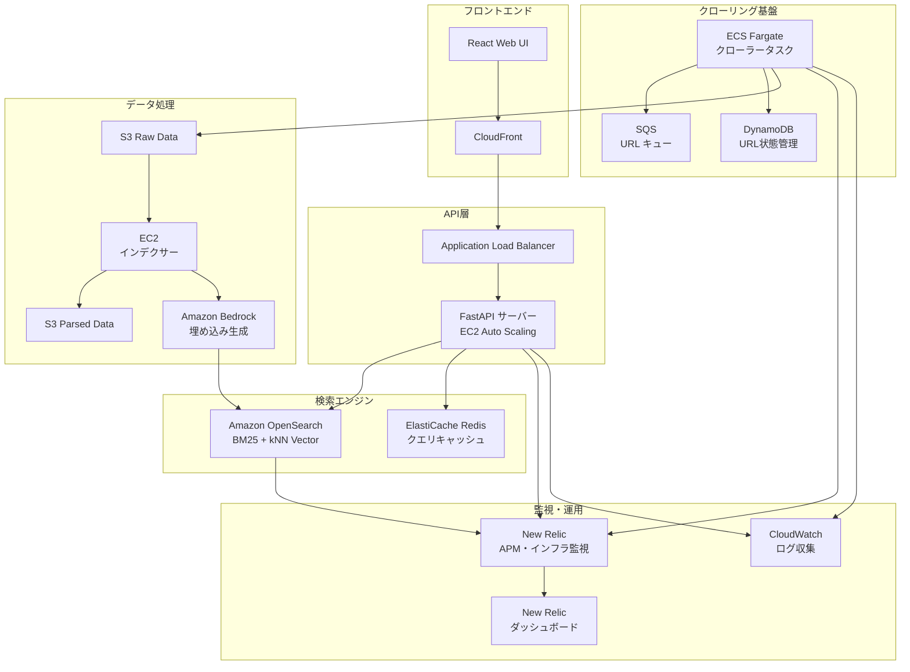

# 設計書

## 概要

本システムは、Web クローリング、ベクトル埋め込み生成、ハイブリッド検索を組み合わせた包括的な検索プラットフォームです。Amazon OpenSearch と Bedrock 埋め込みを活用し、BM25 とベクトル検索の RRF 統合により高精度な検索体験を提供します。

## アーキテクチャ

### システム全体構成



### データフロー

1. **クローリングフロー**

   - URL 投入 → SQS → ECS Fargate → robots.txt 確認 → HTML 取得 → S3 Raw 保存
   - Lambda トリガー → テキスト抽出 → 言語判定 → S3 Parsed 保存
   - Bedrock 埋め込み生成 → OpenSearch インデックス投入

2. **検索フロー**

   - React UI → FastAPI → OpenSearch (BM25 + kNN) → RRF 統合 → 結果返却
   - キャッシュ確認 → Redis → 高速レスポンス

3. **インデックスフロー**
   - S3 イベント → SQS → EC2 インデクサー → Bedrock 埋め込み → OpenSearch 投入

## コンポーネントと インターフェース

### 1. Web クローラー (ECS Fargate)

**技術スタック:** Python 3.11, BeautifulSoup4, MeCab, requests, newrelic

**主要機能:**

- robots.txt/sitemap.xml 解析
- HTML 取得とテキスト抽出
- 言語判定 (langdetect)
- リンク抽出と URL 正規化
- ドメイン別レート制御
- New Relic インフラ監視統合

**インターフェース:**

```python
class WebCrawler:
    def fetch_url(self, url: str) -> CrawlResult
    def extract_text(self, html: str) -> ParsedContent
    def detect_language(self, text: str) -> str
    def extract_links(self, html: str, base_url: str) -> List[str]
```

### 2. 検索 API (FastAPI)

**技術スタック:** Python 3.11, FastAPI, opensearch-py, redis-py, newrelic

**主要機能:**

- ハイブリッド検索実行
- RRF (Reciprocal Rank Fusion) スコア統合
- 結果ハイライト生成
- キャッシュ管理
- New Relic APM 統合

**API エンドポイント:**

```python
@app.get("/search")
async def search(
    q: str,
    page: int = 1,
    size: int = 10,
    lang: Optional[str] = None,
    site: Optional[str] = None
) -> SearchResponse

@app.get("/suggest")
async def suggest(q: str) -> List[str]

@app.get("/health")
async def health() -> HealthStatus
```

### 3. インデクサー (EC2)

**技術スタック:** Python 3.11, boto3, opensearch-py, SQS polling, newrelic

**主要機能:**

- SQS メッセージ処理
- Bedrock 埋め込み生成
- OpenSearch バルク投入
- エラーハンドリング
- New Relic APM 統合

**処理フロー:**

```python
class DocumentIndexer:
    def process_queue(self):
        # SQSメッセージポーリング
        # S3からドキュメント読み込み
        # Bedrock埋め込み生成
        # OpenSearchバルク投入
        # 処理完了後メッセージ削除

    def handle_error(self, message, error):
        # エラー時DLQ送信
        # CloudWatchメトリクス送信
```

### 4. React Web アプリケーション

**技術スタック:** React 18, TypeScript, Tailwind CSS, Axios, New Relic Browser

**主要コンポーネント:**

- SearchBox: 検索入力とサジェスト
- SearchResults: 結果一覧表示
- ResultItem: 個別結果表示 (ハイライト付き)
- Pagination: ページネーション
- Filters: サイト・言語フィルター
- New Relic Browser 監視統合

**型安全性:**

- FastAPI OpenAPI スキーマから自動生成された TypeScript 型定義
- CI/CD パイプラインでの型定義同期
- コンパイル時の型チェックによる API 契約保証

## データモデル

### OpenSearch インデックス設計

```json
{
  "mappings": {
    "properties": {
      "title": {
        "type": "text",
        "analyzer": "japanese_analyzer",
        "fields": {
          "keyword": { "type": "keyword" }
        }
      },
      "body": {
        "type": "text",
        "analyzer": "japanese_analyzer"
      },
      "url": { "type": "keyword" },
      "site": { "type": "keyword" },
      "lang": { "type": "keyword" },
      "published_at": { "type": "date" },
      "crawled_at": { "type": "date" },
      "embedding": {
        "type": "knn_vector",
        "dimension": 1536,
        "method": {
          "name": "hnsw",
          "space_type": "cosinesimil",
          "engine": "nmslib"
        }
      },
      "content_hash": { "type": "keyword" },
      "popularity_score": { "type": "float" }
    }
  },
  "settings": {
    "analysis": {
      "analyzer": {
        "japanese_analyzer": {
          "type": "custom",
          "tokenizer": "mecab_tokenizer",
          "filter": ["lowercase", "stop"]
        }
      }
    }
  }
}
```

### DynamoDB テーブル設計

**URL ステート管理テーブル:**

```json
{
  "TableName": "aedhack-dev-url-states",
  "KeySchema": [{ "AttributeName": "url_hash", "KeyType": "HASH" }],
  "AttributeDefinitions": [
    { "AttributeName": "url_hash", "AttributeType": "S" },
    { "AttributeName": "domain", "AttributeType": "S" },
    { "AttributeName": "last_crawled", "AttributeType": "N" }
  ],
  "GlobalSecondaryIndexes": [
    {
      "IndexName": "domain-last-crawled-index",
      "KeySchema": [
        { "AttributeName": "domain", "KeyType": "HASH" },
        { "AttributeName": "last_crawled", "KeyType": "RANGE" }
      ]
    }
  ]
}
```

## エラーハンドリング

### 1. クローラーエラー処理

**HTTP エラー:**

- 4xx: 永続的エラーとして記録、再試行しない
- 5xx: 指数バックオフで最大 3 回リトライ
- タイムアウト: 30 秒後にリトライ

**処理エラー:**

- パース失敗: エラーログ記録、次の URL に進む
- 言語判定失敗: デフォルト言語 (ja) を設定

### 2. 検索 API エラー処理

**OpenSearch エラー:**

- 接続エラー: サーキットブレーカーパターン適用
- クエリエラー: バリデーション強化、フォールバック検索

**レスポンス処理:**

```python
@app.exception_handler(OpenSearchException)
async def opensearch_exception_handler(request, exc):
    return JSONResponse(
        status_code=503,
        content={"error": "Search service temporarily unavailable"}
    )
```

### 3. インデクサーエラー処理

**SQS メッセージ処理:**

- 処理失敗: メッセージ可視性タイムアウト後に再試行
- 最大リトライ回数超過: DLQ に送信

**Bedrock API 制限:**

- レート制限: 指数バックオフ + ジッター
- クォータ超過: DLQ に送信、アラート発火

**OpenSearch 投入エラー:**

- バルク投入失敗: 個別ドキュメントで再試行
- インデックス容量不足: アラート + 自動スケーリング

## テスト戦略

### 1. 単体テスト

**クローラー:**

- robots.txt 解析テスト
- HTML パーステスト
- 言語判定精度テスト
- レート制御テスト

**検索 API:**

- クエリ変換テスト
- RRF 統合テスト
- キャッシュ動作テスト
- レスポンス形式テスト

### 2. 統合テスト

**エンドツーエンド:**

- クロール → インデックス → 検索フロー
- 増分更新テスト
- 障害復旧テスト

**パフォーマンステスト:**

- 検索レイテンシ測定 (目標: P95 ≤ 500ms)
- 同時接続数テスト (目標: 100 QPS)
- 大量データ投入テスト (目標: 10 万ドキュメント)

### 3. 品質評価テスト

**検索精度:**

- NDCG@10 評価 (目標: ≥ 0.35)
- Recall@10 評価
- ハイブリッド vs BM25 単体比較

**ユーザビリティ:**

- レスポンス時間測定
- UI 操作性テスト
- 多言語対応テスト

### 4. New Relic 監視統合

**APM 監視:**

- アプリケーションパフォーマンス追跡
- データベースクエリ監視
- 外部 API 呼び出し監視

**インフラ監視:**

- EC2/ECS リソース使用率
- OpenSearch クラスター状態
- ネットワークトラフィック

**ブラウザ監視:**

- フロントエンドパフォーマンス
- ユーザーセッション追跡
- エラー率とページロード時間

### 5. テスト自動化

**CI/CD パイプライン:**

```yaml
# GitHub Actions例
test:
  - unit_tests: pytest crawler/ search-api/
  - integration_tests: docker-compose up -d && pytest tests/integration/
  - performance_tests: locust -f tests/performance/
  - quality_tests: python tests/quality/ndcg_evaluation.py
  - newrelic_deployment: newrelic deployment record

type_sync:
  - schema_generation: python tools/generate_ts_types.py
  - type_check: npm run type-check
  - frontend_build: npm run build
  - auto_pr: create PR if types changed
```

**テストデータ管理:**

- サンプル HTML: tests/fixtures/html/
- 評価クエリセット: tests/fixtures/queries.json
- 期待結果: tests/fixtures/expected_results.json
